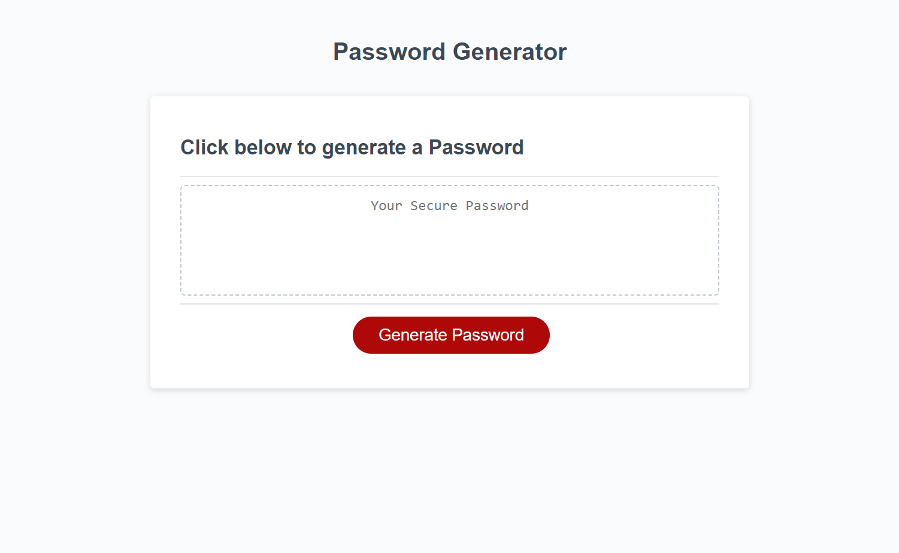

# <Password-generator>

## Description
This project is aimed to provide a randomly generated password to the user when the user indicates the length and characters they would like to include presented to them through various prompts when the button to generate a password is clicked.

## Usage

The image below shows the website when the console is opened. It generates a random password based on information provided by the user. Once clicked on the Generate Password button the user is asked to type in the desired length for their password. Then they are asked if they would like to have special characters, numbers, uppercase and lowercase letters respectfully. After all the criteria are requested by the user the webpage returns their unique password.

## Deployment
The deployed website is available at:

[Password Generator](https://cemileblks.github.io/password-generator/)

## License

This project is licensed under the MIT License. Please refer to the LICENSE in the repo.